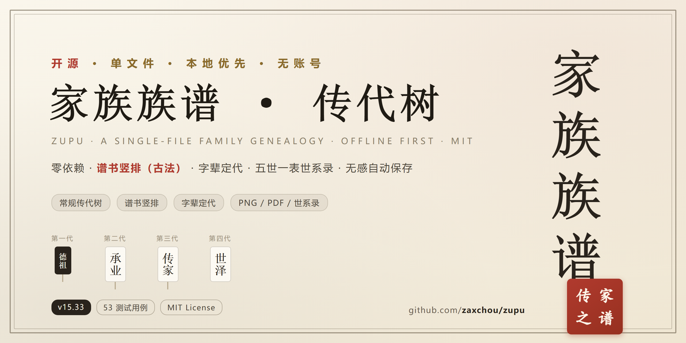
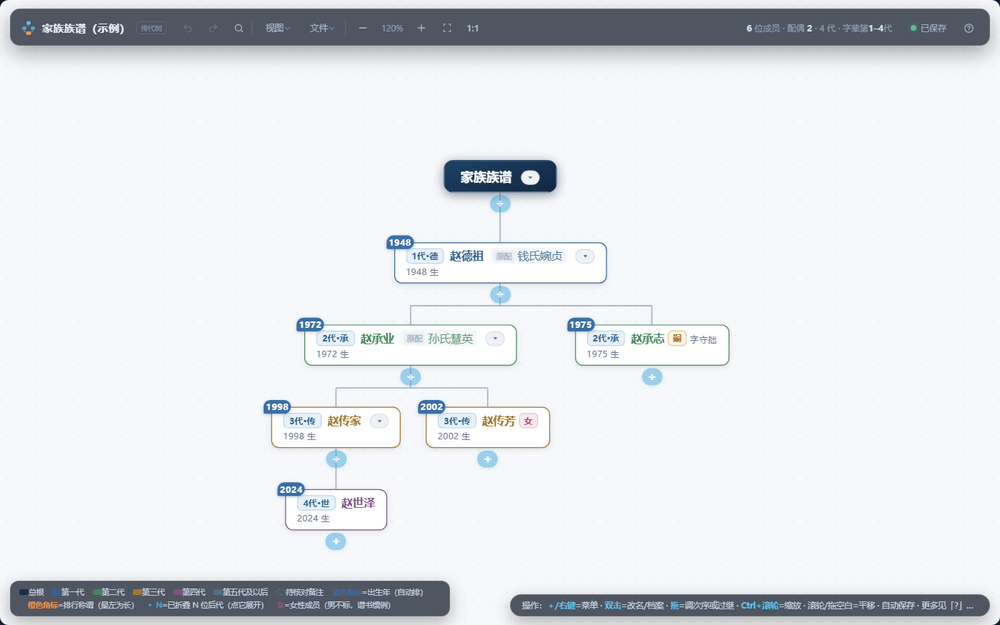
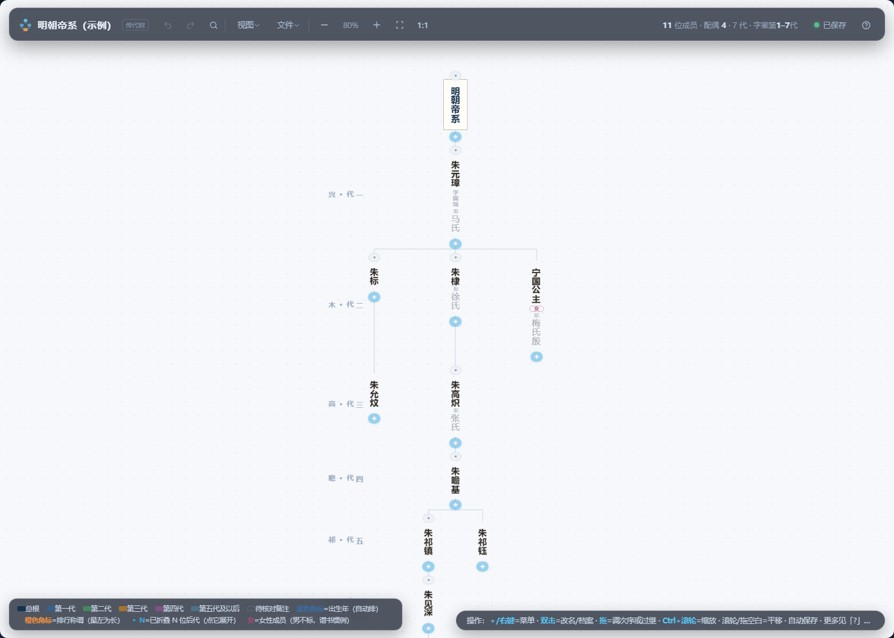

[中文](README.md) | **English** | [日本語](README.ja.md)

# Zupu · Family Tree

**Single file · Zero dependencies · Local-first open-source genealogy**

*Put family-tree keeping back on every family's own computer.*

---

**One HTML file is all there is**: double-click it and start building your family tree.
No network, no account, no server — your data lives only in your own browser, and every
edit is saved automatically. English version: `index-en.html`. 日本語は [`index-ja.html`](README.ja.md)（[日本語 README](README.ja.md)）.

| Standard tree | Vertical book layout (traditional) |
| --- | --- |
|  |  |

The **vertical book layout** follows the conventions of traditional Chinese genealogy
books: generations as rows, names written top-to-bottom (right to left), generation
labels in the left margin — print it / export it to PDF and **bind it into a book**.

## ✨ Features

- **Two views** — standard tree / vertical book layout; printing follows the current view
- **Full editing** — add / delete / rename / profiles (sex, adoption in·out·dual-heir,
  courtesy & art names, no-issue mark), drag to reorder, drag to adopt (cycle-safe),
  undo & redo
- **Zibei generations** — define your generation-char table; every member's generation
  is inferred from their name, alignable with a book's numbering
- **Pedigree preface** — tree name, hall name, lineage, founder record, family origin;
  automatically included in exports
- **Spouse conventions** — book-style display, per-spouse terms (m. / 2nd m. / betrothed / concubine)
- **Exports** — PNG / PDF / **Genealogy tables (European style, five generations per table)** /
  Markdown / book print
- **Auto-save** — edits are saved instantly (browser-local); back up to json to move machines
- **Three languages** — 中文 / English / 日本語, same data model, interchangeable backups

## 🚀 Quick start

**Option 0 (fastest)**: open the online version → **[https://zaxchou.github.io/zupu/](https://zaxchou.github.io/zupu/)**
(Chinese UI; use `index-en.html` from a release for English).

**Option 1 (local, recommended)**: from [Releases](https://github.com/zaxchou/zupu/releases),
download the single file for your language — English: `index-en.html` (中文 `index.html`,
日本語 `index-ja.html`) — or grab the full zip. Double-click it; a first-run wizard appears:

- **Explore the demo** — a sample tree you can play with freely
- **Start from scratch** — enter your family name and start with generation one
- **Import a backup** — restore json exported by this tool

**Option 2**: `git clone` this repo and double-click `index-en.html`.

To record your own family: double-click a name to rename, click “＋” to add members,
“View ▾ → Pedigree preface” sets the tree name / generation chars / lineage —
make it entirely yours.

## ❓ FAQ

**Where is my data stored? Can it be lost?**
In this browser on this computer (localStorage). Nothing is ever uploaded. Export a json
backup regularly via “File ▾ → Backup to file”; restore it anywhere via “Restore backup”.

**Multi-user editing / online sync?**
No — by design. Genealogy data is private and edited rarely; a local single file is the
most dependable shape. To collaborate, share a backup json and merge edits by hand.

**The demo names are not mine?**
Just a sample — everything is editable under “Pedigree preface”, and you can paste your
own generation-char table.

**What if browser data gets cleared?**
That's what backups are for. `data.json` in the repo is a sample snapshot; your own
backups are in your hands.

## 🤝 Contributing

Issues / PRs welcome: `handoff.md` documents the architecture and hard-won lessons —
please read it before changing code; run the full test suite in `tests/` before
submitting. See [CONTRIBUTING.md](CONTRIBUTING.md).
The English and Japanese builds are generated from the Chinese master via
`tools/build_i18n.py` — change `index.html`, then re-run the script.

## 📄 License

[MIT](LICENSE) © zaxchou
