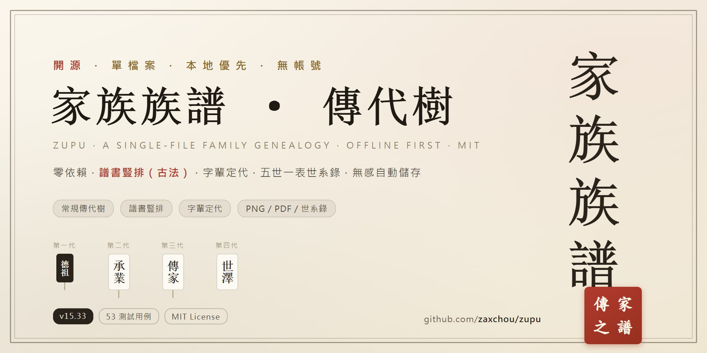

[简体中文](README.md) | **繁體中文** | [English](README.en.md) | [日本語](README.ja.md)

# 家族族譜 · 傳代樹 (Zupu)

**單一檔案 · 零依賴 · 本地優先的開源族譜應用**

*把修譜這件事，放回每個家庭的電腦裡。*

---

**一個 HTML 檔案就是全部**：雙擊開啟，為你的家族建一棵傳代樹。
不連線、無帳號、無伺服器，資料只存在你自己的瀏覽器裡，編輯即自動儲存。
本檔案為繁體中文版：`index-zh-Hant.html`。

| 常規傳代樹 | 譜書豎排（古法） |
| --- | --- |
|  |  |

**譜書豎排**按傳統修譜版式還原：世代成行、名字豎書（右→左）、行左標世數、墨字吊線——
列印 / 匯出 PDF 即可**裝訂成冊**。

## ✨ 功能

- **兩種檢視** — 常規傳代樹 / 譜書豎排（古法），列印跟隨檢視模式
- **四種語言** — 簡體 `index.html` / 繁體 `index-zh-Hant.html` / English `index-en.html` /
  日本語 `index-ja.html`，介面與示例譜各自本地化，備份 json 四語通用
- **編輯齊全** — 新增 / 刪除 / 重新命名 / 檔案（性別、過繼嗣子·嗣出·兼祧、字、號、止）、
  拖拽排序、拖動過繼（防成環）、復原重做
- **字輩定代** — 自訂字輩表，按名字自動推算每人世代，支援譜書世數基準對齊
- **譜序** — 譜名、堂號、源流世系、始祖記、家族來源，匯出自動帶上
- **配偶體例** — 譜書式顯示、按人指定 配 / 繼配 / 娶 / 聘 / 側室
- **匯出** — PNG / PDF / **世系錄（歐式五世一表）** / Markdown / 裝訂列印
- **無感儲存** — 編輯即存（瀏覽器本機），換機用備份 json 一鍵還原

## 🚀 快速開始

**方式〇（最快）**：直接開啟線上版 → **[https://zaxchou.github.io/zupu/](https://zaxchou.github.io/zupu/)**
（線上版為簡體介面；繁體請下載 `index-zh-Hant.html`）

**方式一（本機使用，推薦）**：到 [Releases](https://github.com/zaxchou/zupu/releases) 按語言下載——
繁體 `index-zh-Hant.html` / 簡體 `index.html` / English `index-en.html` / 日本語 `index-ja.html`，
一個檔案就是全部，下載雙擊即用。首次使用會彈出精靈：

- **先看看示例** — 用內建的演示譜熟悉操作
- **從空白開始** — 填上你的譜名（如「陳氏族譜」）和堂號，從第一代建起
- **匯入備份** — 已有本工具匯出的 json，直接還原

**方式二**：`git clone` 本倉庫後雙擊 `index-zh-Hant.html`。

錄入自己家族：雙擊名字改名、點「＋」新增成員、「檢視 ▾ → 譜序」設定譜名 / 堂號 /
字輩表 / 源流——全部改成你家的。

## ❓ 常見問題

**資料存在哪裡？會不會丟？**
存在你電腦的瀏覽器裡（localStorage），不上傳任何伺服器。定期用「檔案 ▾ → 備份到檔案」
匯出 json 即可萬無一失；換電腦用「還原備份」匯入。

**支援多人協作 / 線上同步嗎？**
不支援，這是刻意的設計選擇：族譜資料私密且低頻編輯，本機單檔案是最穩妥的形態。
多人協作請共享備份 json，各自匯入修改後再合併。

**介面文字 / 字輩 / 譜名都是別人家的？**
示例而已——譜序裡全部可改，字輩表貼上你自己家族的字輩即可。

**瀏覽器資料清了會怎樣？**
所以請備份。`data.json` 是倉庫內建的示例快照；你自己的備份在你手裡。

## 🤝 參與貢獻

Issue / PR 都歡迎：`handoff.md` 裡有完整的架構說明與踩坑記錄，改程式碼前建議先讀；
提交前請跑通 `tests/` 全部用例。見 [CONTRIBUTING.md](CONTRIBUTING.md)。
繁體版由 `tools/build_i18n.py` 以 OpenCC 從簡體母本轉換生成。

## 📄 License

[MIT](LICENSE) © zaxchou
